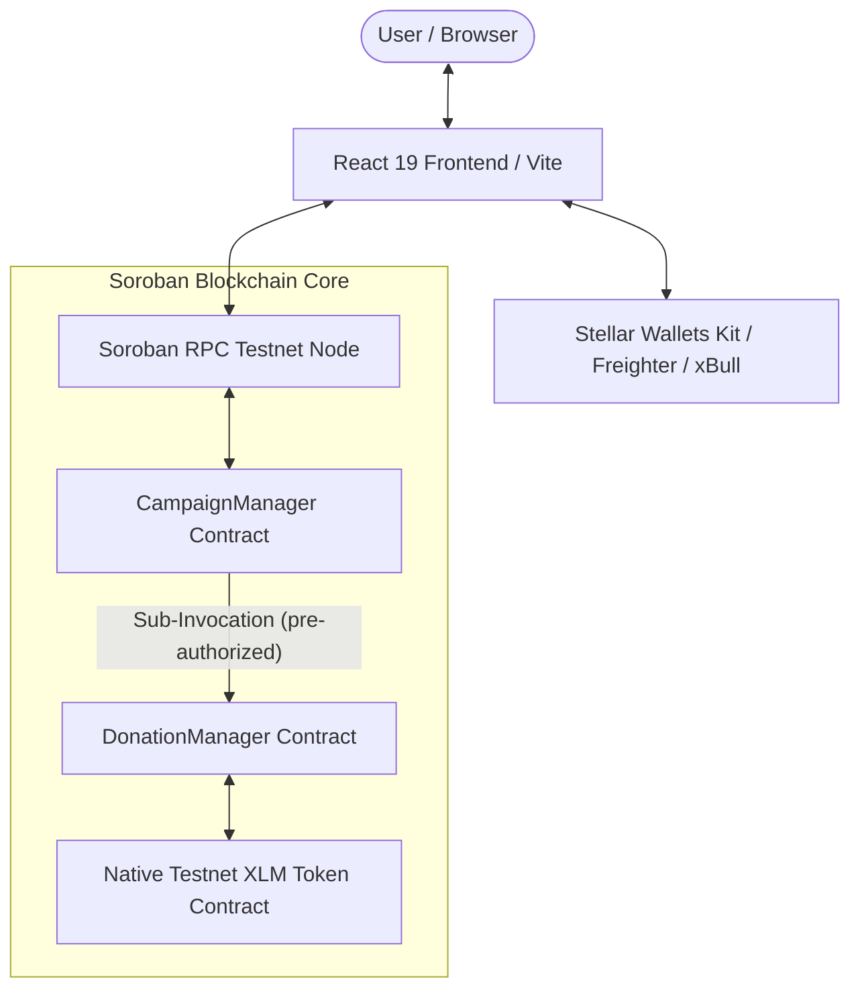

# Stellar Soroban Crowdfunding Platform 🚀

[](https://github.com/AvipsaGanguly/crowdfunding1/actions/workflows/ci.yml)
[](https://opensource.org/licenses/MIT)
[](https://stellar.org)

A next-generation, production-ready decentralized crowdfunding platform built natively on **Stellar Soroban** smart contracts. Launch campaigns, collect donations globally in native Testnet XLM, and manage your fundraising transparently with a glassmorphic React dApp.

---

## 🎥 Demo Video

Watch the full demo walkthrough of the application here:
[Watch Demo Video](https://drive.google.com/file/d/1IKXIlBIyGUvLcy8yq3jmJM8di9v28BDt/view?usp=sharing)

---

## 📖 Project Overview

Traditional crowdfunding platforms suffer from high platform fees, cross-border payment friction, delayed payouts, and centralized control. This project leverages the speed, minimal fees, and native cross-contract capabilities of the **Stellar Soroban** smart contract engine to provide a fully decentralized, non-custodial crowdfunding dApp.

Campaign creators specify a fundraising goal in XLM, a campaign category, and a deadline. Donors can contribute directly using any supported Stellar wallet. Funds are securely locked in the smart contract ecosystem and can be withdrawn by the creator once the deadline passes and conditions are met.

---

## ✨ Features

- **Decentralized Campaign Lifecycle**: Launch, view, and fund campaigns directly on the Stellar Testnet.
- **Cross-Contract Architecture**: Clean separation of concerns between `CampaignManager` (metadata & registry) and `DonationManager` (XLM fund custody & balance accounting).
- **Native Soroban Authorization**: Pre-authorized cross-contract sub-invocations using `env.authorize_as_current_contract(...)` to prevent `Error(Auth, InvalidAction)`.
- **Flexible Descriptions & Responsive Cards**: Optional campaign descriptions with intelligent fallbacks (`"No description provided."`) and responsive cards that automatically adjust height when no image is provided.
- **Multi-Wallet Integration**: Built-in support for Freighter, xBull, Albedo, Lobstr, and Rabet via `@creit.tech/stellar-wallets-kit` with explicit user-initiated wallet connection, switching, and disconnection.
- **Real-Time Blockchain Updates**: On-chain RPC status polling and event stream listeners for dynamic progress bar updates without manual page refreshes.
- **Detailed Transaction Receipts**: Post-donation summary modals displaying transaction hash, status, ledger number, timestamp, and direct links to Stellar Expert explorer.

---

## 🏗️ System Architecture



---

## 📜 Smart Contract Explanation

The smart contract suite consists of two Rust contracts compiled for Soroban WASM targets:

### 1. `CampaignManager` (`contracts/campaign-manager/`)
- **Role**: Primary entry point for campaign creation and metadata retrieval.
- **Key Functions**:
  - `init(env, donation_manager)`: Initializes the contract with the `DonationManager` address.
  - `create_campaign(env, owner, title, description, goal, deadline, category)`: Validates campaign input parameters, assigns a sequential `u64` campaign ID, stores `CampaignMetadata`, pre-authorizes the sub-invocation (`env.authorize_as_current_contract(...)`), and calls `DonationManager::register_campaign`.
  - `get_campaign(env, campaign_id)`: Fetches metadata for a single campaign.
  - `get_all_campaigns(env)`: Iterates through stored campaign IDs and returns all active campaign metadata structs.
  - `close_campaign(env, campaign_id)`: Allows the campaign owner to deactivate a campaign.

### 2. `DonationManager` (`contracts/donation-manager/`)
- **Role**: Manages fund custody, token balance accounting, deposits, and withdrawals.
- **Key Functions**:
  - `init(env, campaign_manager, token_address)`: Configures the associated `CampaignManager` and native XLM token address.
  - `register_campaign(env, campaign_id)`: Restricted function (requires `CampaignManager` auth) that initializes campaign funds to `0`.
  - `donate(env, donor, campaign_id, amount)`: Transfers XLM stroops from the donor to the `DonationManager` contract address and updates `CampaignFunds`.
  - `get_campaign_funds(env, campaign_id)`: Public read-only method returning total raised stroops for a campaign.
  - `withdraw(env, campaign_id)`: Releases accumulated XLM to the campaign creator after deadline verification.

---

## 📍 Deployed Contract Addresses (Stellar Testnet)

| Contract / Asset | Stellar Address / Hash | Explorer Link |
| :--- | :--- | :--- |
| **Campaign Manager** | `CAPFOLYX5LZRFZZUPV374HOEXGLIA7QN3SR5SHA5V75W6PBZBK4KM52V` | [Stellar Expert](https://stellar.expert/explorer/testnet/contract/CAPFOLYX5LZRFZZUPV374HOEXGLIA7QN3SR5SHA5V75W6PBZBK4KM52V) |
| **Donation Manager** | `CAYUM76UIQMEQLE4JBMV2BJWWALTX3T5SGTKV75XBGCE2GQHN3A6YJKR` | [Stellar Expert](https://stellar.expert/explorer/testnet/contract/CAYUM76UIQMEQLE4JBMV2BJWWALTX3T5SGTKV75XBGCE2GQHN3A6YJKR) |
| **Native Testnet XLM Token** | `CDLZFC3SYJYDZT7K67VZ75HPJVIEUVNIXF47ZG2FB2RMQQVU2HHGCYSC` | [Stellar Expert](https://stellar.expert/explorer/testnet/contract/CDLZFC3SYJYDZT7K67VZ75HPJVIEUVNIXF47ZG2FB2RMQQVU2HHGCYSC) |

---

## 🔗 Transaction Hash Examples

- **Campaign Deployment & Init Tx**: [`45a651b8ccf7671cdc22d51a04f4ea2f99d2ecbb6ff3c0739cffcead1909f58e`](https://stellar.expert/explorer/testnet/tx/45a651b8ccf7671cdc22d51a04f4ea2f99d2ecbb6ff3c0739cffcead1909f58e)
- **Donation Manager Init Tx**: [`da39722660ee943d12e58fc7d3e9e48ba4e6b3653715817501784b5709f5932f`](https://stellar.expert/explorer/testnet/tx/da39722660ee943d12e58fc7d3e9e48ba4e6b3653715817501784b5709f5932f)

---

## 🌐 Live Demo

- **Vercel Web App**: [https://crowdfunding1.vercel.app](https://crowdfunding1.vercel.app) *(or your deployed Vercel domain)*
- **Stellar Network**: Testnet (Chain ID: `Test SDF Network ; September 2015`)

---

## 📁 Repository Structure

```text
crowdfunding1/
├── .github/
│   └── workflows/
│       └── ci.yml               # GitHub Actions CI pipeline (Node.js & Rust)
├── contracts/
│   ├── Cargo.toml               # Workspace manifest
│   ├── campaign-manager/        # Campaign Manager smart contract crate
│   │   ├── Cargo.toml
│   │   └── src/
│   │       ├── lib.rs           # Entry point & contract logic
│   │       ├── types.rs         # Data structures & errors
│   │       └── test.rs          # Cross-contract integration tests
│   └── donation-manager/        # Donation Manager smart contract crate
│       ├── Cargo.toml
│       └── src/
│           ├── lib.rs           # Entry point & custody logic
│           ├── types.rs         # Data structures & errors
│           └── test.rs          # Unit tests
├── src/
│   ├── __tests__/               # Vitest unit & component test suite
│   │   ├── CreateCampaign.test.jsx
│   │   ├── Dashboard.test.jsx
│   │   ├── WalletButton.test.jsx
│   │   ├── stellarService.test.js
│   │   └── walletService.test.js
│   ├── components/              # Reusable React components
│   │   ├── CampaignCard.jsx
│   │   ├── DonationSuccessModal.jsx
│   │   ├── Navbar.jsx
│   │   ├── ProgressBar.jsx
│   │   ├── WalletButton.jsx
│   │   └── WalletSelectorModal.jsx
│   ├── hooks/                   # Custom React hooks
│   │   ├── useCampaign.jsx
│   │   ├── useTransaction.js
│   │   └── useWallet.jsx
│   ├── pages/                   # Application pages
│   │   ├── CampaignDetails.jsx
│   │   ├── CreateCampaign.jsx
│   │   ├── Dashboard.jsx
│   │   └── Home.jsx
│   ├── services/                # Stellar & Soroban RPC integration layer
│   │   ├── campaign.js
│   │   ├── contract.js
│   │   ├── stellar.js
│   │   └── wallet.js
│   └── styles/                  # Glassmorphic CSS design system
│       ├── components.css
│       └── global.css
├── .env                         # Environment configuration
├── .gitignore                   # Target & build exclusions
├── deploy.ps1                   # Automated build & deployment script
├── package.json                 # Node dependencies & scripts
├── vercel.json                  # SPA routing configuration for Vercel
├── vite.config.js               # Vite build configuration
└── README.md
```

---

## 💻 Local Setup & Development Guide

### 1. Prerequisites
- **Node.js**: v18.0.0 or higher
- **Rust**: `1.77+` with target `wasm32v1-none` or `wasm32-unknown-unknown`
- **Soroban CLI**: `soroban-cli v20.0+`

### 2. Installation
```bash
git clone https://github.com/AvipsaGanguly/crowdfunding1.git
cd crowdfunding1

# Install frontend dependencies
npm install --ignore-scripts
```

### 3. Environment Configuration
Create a `.env` file in the root directory (or update existing):
```env
VITE_STELLAR_NETWORK=testnet
VITE_SOROBAN_RPC_URL=https://soroban-testnet.stellar.org
VITE_CAMPAIGN_MANAGER_ID=CAPFOLYX5LZRFZZUPV374HOEXGLIA7QN3SR5SHA5V75W6PBZBK4KM52V
VITE_DONATION_MANAGER_ID=CAYUM76UIQMEQLE4JBMV2BJWWALTX3T5SGTKV75XBGCE2GQHN3A6YJKR
```

### 4. Running Locally
```bash
npm run dev
```

---

## 🧪 Testing

The platform maintains comprehensive automated test coverage across both smart contract and frontend layers.

### 1. Smart Contract Tests (Rust / Soroban)
Runs 10 unit and integration test cases across `campaign-manager` and `donation-manager` crates:
```bash
cd contracts
cargo test --workspace
```

### 2. Frontend Test Suite (Vitest + React Testing Library)
Runs 34 component and service test cases across 8 test suites (`formatUtils`, `explorerUtils`, `ProgressBar`, `WalletButton`, `CreateCampaign`, `Dashboard`, `stellarService`, `walletService`):
```bash
npm test
```

---

## 🚀 Building & Deployment

### Build Smart Contracts
```bash
cd contracts
soroban contract build
```

### Deploy & Initialize Contracts to Testnet
Run the automated deployment script:
```powershell
.\deploy.ps1
```

### Build Production Frontend
```bash
npm run build
```

---

## 🖼️ Screenshots


---

## ✅ Production Readiness & Level 3 Checklist

- [x] **Advanced Soroban Smart Contracts**: WASM compiled `CampaignManager` and `DonationManager` with cross-contract sub-invocations.
- [x] **Event Streaming & Real-Time RPC Updates**: Polling event engine for ledger-level donation event decoding.
- [x] **Multi-Wallet Integration**: Support for Freighter, xBull, Albedo, Lobstr, and Rabet via `@creit.tech/stellar-wallets-kit`.
- [x] **CI/CD Pipeline**: GitHub Actions workflow testing Node 20 & Rust WASM targets on every push.
- [x] **Automated Test Suite**: 34 Vitest frontend tests + 10 Soroban Rust contract tests.
- [x] **Live Vercel Deployment**: Configured with SPA route rewrites and live SSL endpoints.

---

## 🔮 Future Improvements

- **Multi-Asset Support**: Expand beyond native XLM to support USDC and custom Stellar assets.
- **Milestone-Based Payouts**: Introduce multi-sig milestone approvals before releasing funds to creators.
- **DAO Governance**: Implement community voting on campaign validation and featured listings.

---

## 📄 License

This project is licensed under the [MIT License](LICENSE).
